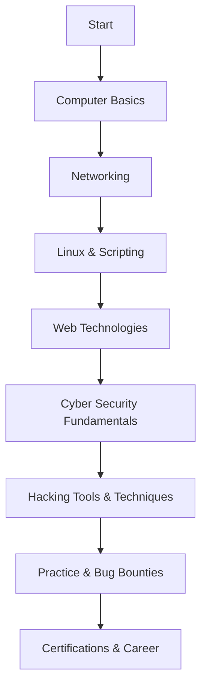

# 🚀 Cyber Security & Ethical Hacking Roadmap

Welcome to your journey into the world of **Cyber Security** and **Ethical Hacking**! This guide provides a structured roadmap, recommended resources, and actionable steps to help you become a skilled ethical hacker.

---

  

---

## 🌟 Why Learn Cyber Security?

- **Protect digital assets**
- **Fight cybercrime**
- **High demand in job market**
- **Constantly evolving field**

---

## 🎯 Roadmap Overview

---

## 📚 Step-by-Step Roadmap

### 1️⃣ Basic Computer Skills

> **Learn:**
> - Operating Systems (Windows, Linux)
> - File systems, command line, installations

---

### 2️⃣ Networking Fundamentals

> **Learn:**
> - OSI & TCP/IP Models
> - IP Addressing, Subnetting
> - Protocols: HTTP, DNS, TCP, UDP, etc.
> - Common network devices

**Resources:**
- [Cisco Networking Basics](https://www.cisco.com/c/en/us/products/switches/what-is-network-switch.html)
- [Practical Networking](https://www.practicalnetworking.net/)

---

### 3️⃣ Linux & Scripting

> **Learn:**
> - Linux CLI (Ubuntu, Kali)
> - Bash scripting
> - Python basics

**Resources:**
- [Linux Journey](https://linuxjourney.com/)
- [OverTheWire: Bandit](https://overthewire.org/wargames/bandit/)

---

### 4️⃣ Web Technologies

> **Learn:**
> - HTML, CSS, JavaScript basics
> - How the web works (HTTP/S, cookies, sessions)
> - Databases basics (SQL)

**Resources:**
- [MDN Web Docs](https://developer.mozilla.org/)
- [OWASP WebGoat](https://owasp.org/www-project-webgoat/)

---

### 5️⃣ Cyber Security Fundamentals

> **Learn:**
> - Types of attacks (phishing, malware, etc.)
> - Security principles (CIA triad)
> - Firewalls, IDS/IPS, VPNs

**Resources:**
- [Cybrary Security Basics](https://www.cybrary.it/course/intro-to-it-and-cybersecurity/)
- [TryHackMe: Introduction to Cyber Security](https://tryhackme.com/room/introtooffensivesecurity)

---

### 6️⃣ Hacking Tools & Techniques

> **Learn:**
> - Kali Linux tools (Nmap, Metasploit, Burp Suite, Wireshark)
> - Vulnerability scanning
> - Social engineering basics

**Resources:**
- [Hack The Box Academy](https://academy.hackthebox.com/)
- [TryHackMe Paths](https://tryhackme.com/paths)

---

### 7️⃣ Practice: CTFs & Bug Bounties

> **Do:**
> - Capture The Flag (CTF) challenges
> - Bug bounty platforms (HackerOne, Bugcrowd)
> - Document your learning

**Resources:**
- [CTFtime](https://ctftime.org/)
- [HackerOne](https://www.hackerone.com/)
- [Bugcrowd](https://www.bugcrowd.com/)

---

### 8️⃣ Certifications & Career Path

> **Popular Certifications:**
> - CompTIA Security+
> - CEH (Certified Ethical Hacker)
> - OSCP (Offensive Security Certified Professional)

**Resources:**
- [CompTIA Security+](https://www.comptia.org/certifications/security)
- [Offensive Security](https://www.offensive-security.com/)

---

## 🎨 Tips to Make Learning Fun

- Use **colorful notes** and mind maps
- Join **online communities** (Discord, Reddit)
- Try **gamified platforms** (TryHackMe, Hack The Box)
- **Stay updated** with cybersecurity blogs & podcasts

---

  
   
  <b style="color: #27ae60; font-size: 1.2em;">Happy Hacking & Stay Ethical!</b>

---

## 📌 Useful Links

- [Awesome Hacking Resources](https://github.com/Hack-with-Github/Awesome-Hacking)
- [OWASP Top 10](https://owasp.org/www-project-top-ten/)
- [Red Team Village](https://www.redteamvillage.io/)

---

> _**"The best way to learn is by doing. Start small, stay consistent, and always follow ethical guidelines!"**_
